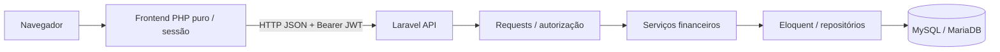

# Diagnóstico e arquitetura proposta

## Inventário anterior à implementação

Em 14/09/2026, a pasta `C:\Coorporativo\xampp\htdocs\financapessoal` estava vazia, inclusive de arquivos ocultos. Não havia Laravel, frontend PHP, dependências, autenticação, migrations, rotas, componentes ou repositório Git. Não foram encontrados arquivos AGENTS.md na pasta ou nos diretórios ancestrais consultados.

Ambiente detectado: PHP CLI 8.2.12 em `C:\dev\xampp\php\php.exe`, Composer 2.9.5, extensões PDO MySQL, PDO SQLite, BCMath, cURL, mbstring, OpenSSL e ZIP. Apache ativo nas portas 80/443; MariaDB 10.4.32 na porta 3306. O caminho do PHP instalado é diferente do caminho desta pasta de projeto.

O usuário informou `localhost`, usuário `root`, senha vazia e banco `db_financeiro_pessoal`. A conexão foi verificada e o banco não continha tabelas. Nenhum banco existente será apagado. Testes destrutivos de migrations usarão somente SQLite em memória.

## Decisões técnicas

- Laravel 12 / PHP 8.2 para compatibilidade com o ambiente. Laravel 13 exige PHP 8.3. Dependências exatas serão fixadas em composer.lock. Referência: [releases oficiais](https://laravel.com/docs/12.x/releases).
- API exclusivamente JSON; controllers coordenam requests, serviços e resources. Eloquent faz persistência; repositórios serão introduzidos quando houver consultas reutilizáveis, sem interfaces vazias por antecipação.
- JWT será implementado na Fase 2 com biblioteca mantida, expiração, revogação e renovação. Nenhuma rota financeira será publicada sem autenticação e autorização.
- MariaDB local pelo driver MySQL; migrations compatíveis com MySQL e suíte rápida em SQLite. Dinheiro usa DECIMAL(15,2), retornado como string pelos models; taxas usam DECIMAL(8,4). Cálculos futuros usarão centavos inteiros/BCMath, nunca float.
- Toda entidade financeira possui user_id. FKs compostas vinculam referências ao mesmo proprietário. Escopo explícito `forUser` será usado pelas consultas; policies e middleware ficam na Fase 2/3. O escopo de consulta não substitui autorização.
- Cadastros usam soft deletes; fatos financeiros e históricos serão cancelados/revertidos por ações auditadas, sem exclusão destrutiva via API.
- Compra, transferência e pagamento de fatura possuem estruturas distintas. O orçamento é planejamento, não lançamento. Saldo atual, progresso de parcelas e totais serão derivados dos fatos, evitando colunas duplicadas como fonte de verdade.
- Datas de competência e vencimento são separadas. Backend interpreta datas no fuso America/Sao_Paulo; datas financeiras são DATE.
- PHP puro no frontend, sessões com token no servidor, cliente HTTP e CSRF nas ações. Tailwind, JavaScript/Fetch e Chart.js entram na Fase 13. Não há Blade, React ou framework PHP no frontend.
- OpenAPI documentará somente endpoints existentes em cada fase. Testes e documentação acompanham o desenvolvimento; fases 11/12 consolidam a cobertura.

## Estrutura

```text
backend/
  app/Http/{Controllers,Requests,Resources}
  app/{Models,Services,Repositories,Rules,Enums,Exceptions,Actions,Helpers}
  config/ routes/api.php
  database/{migrations,seeders,factories}
  tests/{Feature,Unit} docs/openapi.json
frontend/
  config/ app/{Auth,Services,Helpers,Views} api/
  public/assets/{css,js,images}
  views/ components/ routes/
docs/
```

## Fluxo futuro


