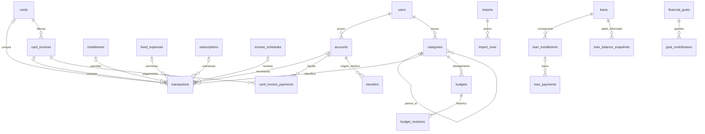

# Modelo de dados

Modelo proposto antes das migrations. Os detalhes definitivos de colunas, índices e FKs ficam nas migrations versionadas.

| Grupo | Tabelas | Responsabilidade |
|---|---|---|
| Identidade | users, user_preferences | Usuário, status e configuração ainda indefinida de renda líquida |
| Cadastros | accounts, cards, categories, merchants | Contas, cartões, hierarquia de categorias e estabelecimentos |
| Movimento | transactions, transfers | Receitas/despesas e transferências independentes |
| Cartões | card_invoices, card_invoice_payments | Competências de fatura e liquidação sem nova despesa |
| Parcelas | installments | Compra parcelada; cada parcela é um transaction com número, competência, vencimento e status |
| Recorrências | fixed_expenses, subscriptions, income_schedules | Definições editáveis; geração de previsões será implementada nas fases 6/8 |
| Dívidas | loans, loan_installments, loan_payments, loan_balance_snapshots | Contrato, cronograma, pagamentos/amortizações/quitação e saldo informado |
| Planejamento | budgets, budget_revisions | Meta mensal por categoria/subcategoria e histórico anterior às alterações |
| Metas | financial_goals, goal_contributions | Meta financeira e contribuições vinculáveis a transferências |
| Importação | imports, import_rows | Arquivo, mapeamento, prévia, rastreio e identificador de duplicidade |
| Auditoria | audit_logs | Autor, entidade, ação e mudanças sem credenciais |
| Infraestrutura | cache, cache_locks, migrations | Rate limiting/cache e controle de versões do banco |

## Relacionamentos e invariantes

- PK BIGINT, timestamps e índices por usuário/data/competência. Cadastros referenciados não são apagados em cascata.
- Cada FK entre entidades financeiras inclui user_id; o banco rejeita referências a contas/categorias de outro usuário.
- Categoria/subcategoria exige mesma árvore e tipo; a validação semântica será aplicada antes da escrita nas fases dos CRUDs. A Fase 1 protege existência/proprietário e enumerações; não expõe operações financeiras.
- DECIMAL preserva centavos; casts monetários retornam strings. Não há campos com float para dinheiro.
- categories.parent_scope e budgets.subcategory_scope são colunas geradas para garantir unicidade inclusive quando o pai/subcategoria é NULL.
- Orçamento único por usuário/ano/mês/categoria/subcategoria; revisions guardarão versão anterior e autor. Copiar 2027 para 2028 não altera registros de 2027.
- Parcela única por installment_id + installment_number. O pai não duplica a despesa; transactions contém somente as parcelas. Evita-se FK circular transaction_id/ installment_id no cabeçalho da compra.
- Geração recorrente possui chaves únicas por definição e competência. Não duplica lançamentos ao repetir o agendamento.
- Importação associa fingerprint opcional único por usuário aos lançamentos importados. Lançamentos manuais podem ter mesma data/valor/descrição, por isso não recebem fingerprint obrigatório.
- card_invoice_payments e transfers não entram na soma de despesas. Seu efeito sobre saldo de conta será calculado nas fases financeiras.
- accounts.current_balance, installments.current_installment e loans.outstanding_balance serão projeções calculadas/expostas pela API. O saldo informado do empréstimo é um snapshot datado; não será apresentado como amortização calculada.
- Não se calcula tabela Price/SAC, juros futuros, IOF adicional ou quitação a partir de hipóteses. O contrato aceita valores informados e datas a confirmar.
- Seeds iniciais serão versionados como configuração, sem criar usuário com senha padrão nem movimentação fictícia. A carga por usuário entrará junto dos módulos correspondentes.

## Aplicação das fases 6–8

O modelo acima permanece a base. As migrations adicionais `2026_09_16_000001` e `2026_09_16_000002` foram aplicadas sem recriar tabelas:

- subscriptions.billing_anchor_date conserva o dia de cobrança original;
- income_schedules.template_key e loans.template_key identificam os rascunhos iniciais por usuário;
- loans guarda referências por proprietário para categoria, subcategoria e conta, além de cash_flow_mode;
- transactions.loan_id vincula despesas do contrato e cash_flow_effect distingue dedução em folha já abatida da renda;
- loan_payments.transaction_id reutiliza a previsão paga; loan_installments.settled_by_payment_id permite estornar quitação sem restaurar parcelas incorretas;
- goal_contributions.cancelled_at preserva o histórico de estornos;
- user_preferences.planning_initialized_at registra conclusão da carga inicial, preservando renomeações e alterações posteriores.

Revisões orçamentárias, saldos derivados, pagamentos e validações semânticas já estão implementados nas fases 2–8. O esquema aplicado contém 29 tabelas e 337 colunas, detalhadas no [dicionário](dicionario-de-dados.md).
